# MSc DE1 — Distributed Systems: Containerising and Orchestrating a Flask Application

Coursework submission that takes an unmodified sample Flask application and makes it
production-deployable: a hardened multi-stage Docker image, a Docker Compose definition, a
published Docker Hub repository, and a three-node Kubernetes cluster running on kind.

## 1. Objective and architecture

### Objective

The application code itself is deliberately left almost untouched. The work is in everything
around it:

| Goal | How it is met |
|---|---|
| Run the app on a production WSGI server | gunicorn with 2 workers, replacing Flask's development server |
| Build a small, hardened image | Multi-stage `Dockerfile`, non-root user, pip stripped from the final image |
| Reduce the vulnerability surface | Docker Scout scan before/after, findings cut from 36 to 29 (see `security/`) |
| Run it reproducibly | `compose.yaml` with pinned image tag, resource limits and hardening |
| Publish it | Public Docker Hub repository, recorded by digest |
| Orchestrate it | 3-node kind cluster, Deployment + Service + NetworkPolicy in a dedicated namespace |

### Architecture

The same container image is used at every stage — locally, in Compose, and in Kubernetes —
so what runs in the cluster is provably the artefact that was scanned and published.

```mermaid
flowchart TD
    subgraph build["Build"]
        DF["Dockerfile<br/>multi-stage"] --> IMG["abedadounkpe/msc-de1-flask-app:1.0.0"]
        IMG --> HUB["Docker Hub<br/>(public)"]
    end

    subgraph local["Local runtime"]
        IMG --> DC["docker compose<br/>host :8000"]
    end

    subgraph k8s["kind cluster — namespace msc-de1-project"]
        SVC["Service flask-app<br/>ClusterIP :80"] --> P1["Pod 1<br/>gunicorn :8000<br/>(worker node 1)"]
        SVC --> P2["Pod 2<br/>gunicorn :8000<br/>(worker node 2)"]
        NP["NetworkPolicy<br/>default-deny + allow :8000"] -.guards.-> P1
        NP -.guards.-> P2
    end

    HUB --> KL["kind load docker-image"]
    KL --> P1
    KL --> P2
    PF["kubectl port-forward<br/>localhost:8080"] --> SVC
```



Inside each pod, gunicorn runs **2 worker processes** as UID 10001 on a read-only root
filesystem, with a writable `emptyDir` at `/tmp` for gunicorn's worker heartbeat files.

### Repository structure

```
├── app/                  Flask application package (routes)
├── tests/                Unit tests (4 tests)
├── run.py                Entry point; exposes the `app` object gunicorn serves
├── requirements.txt      Pinned dependencies
├── Dockerfile            Multi-stage build, non-root, HEALTHCHECK
├── compose.yaml          Single-service Compose definition with hardening
├── kind/
│   └── kind-config.yaml  3-node cluster (1 control-plane, 2 workers)
├── k8s/
│   ├── namespace.yaml    Namespace msc-de1-project
│   ├── configmap.yaml    Non-secret environment configuration
│   ├── deployment.yaml   2 replicas, probes, resources, RollingUpdate, securityContext
│   ├── service.yaml      ClusterIP :80 → container :8000
│   └── network-policy.yaml  default-deny ingress + allow TCP 8000
├── security/             SBOM and Docker Scout scans (before / after)
└── evidence/             Screenshots taken at each step
```

## 2. Original starter application

This repository is a fork of the UBC Flask sample application:

- **Upstream:** <https://github.com/ubc/flask-sample-app>
- **This fork:** <https://github.com/AbedAdounkpe/flask-sample-app>

The upstream commit is preserved in the history (`1b3a39d Add sample app`), so the
containerisation work can be diffed against the original. Original author: Pan Luo.

Changes made to the application itself are limited to `requirements.txt` (pinning versions
and adding gunicorn — see §12). `app/routes.py` is functionally unchanged.

## 3. Prerequisites

| Tool | Version used | Needed for |
|---|---|---|
| Python | 3.12 | Running the app and tests outside a container (§4) |
| Docker Engine / Docker Desktop | 29.7.2 | Building and running the image (§5, §6) |
| Docker Compose | v2 (`docker compose`, built in) | §6 |
| kind | v0.33.0 | Creating the local cluster (§8) |
| kubectl | matching cluster v1.37 | Deploying and inspecting (§9, §10) |
| Docker Scout | v1.24.0 | Optional — reproducing the vulnerability scans |

Docker Desktop must be running before any kind command, because kind nodes are themselves
Docker containers. On Windows, all commands below were run in PowerShell.

Verify the toolchain:

```bash
docker version
kind version
kubectl version --client
```

## 4. Running the original application locally

This is the pre-container path, useful for comparison and for running the tests.

1. **Clone and enter the repository:**

   ```bash
   git clone https://github.com/AbedAdounkpe/flask-sample-app.git
   cd flask-sample-app
   ```

2. **Create and activate a virtual environment:**

   ```bash
   python -m venv venv
   venv\Scripts\activate        # Windows
   source venv/bin/activate     # macOS / Linux
   ```

3. **Install dependencies:**

   ```bash
   pip install -r requirements.txt
   ```

4. **Run the application:**

   ```bash
   python run.py
   ```

   The app is available at <http://localhost:5000>.

   > `run.py` starts Flask's **development** server, which is single-worker and not suitable
   > for production. It is kept only for local development. Every containerised path in this
   > README runs gunicorn on port **8000** instead.

5. **Run the unit tests** (4 tests, all passing):

   ```bash
   python -m unittest discover tests
   ```

## 5. Building and running the Docker image

### Build

```bash
docker build -t abedadounkpe/msc-de1-flask-app:1.0.0 .
```

The `Dockerfile` is a two-stage build. The builder stage creates a virtualenv and installs
the pinned dependencies; the runtime stage copies only that virtualenv and the application
code, creates an unprivileged `appuser` (UID 10001), and runs gunicorn. pip is removed from
both the virtualenv and the runtime base image, since nothing at runtime needs it and it was
responsible for six of the CVEs in the initial scan.

### Run

```bash
docker run -d -p 8000:8000 --name msc-de1-flask-app abedadounkpe/msc-de1-flask-app:1.0.0
```

To run it with the same hardening that `compose.yaml` applies:

```bash
docker run -d -p 8000:8000 --name msc-de1-flask-app \
  --user 10001:10001 \
  --cap-drop ALL \
  --security-opt no-new-privileges:true \
  --read-only --tmpfs /tmp \
  --cpus 0.50 --memory 256m \
  abedadounkpe/msc-de1-flask-app:1.0.0
```

`--tmpfs /tmp` is required alongside `--read-only`: gunicorn's arbiter writes a heartbeat
file per worker under `/tmp`, and without a writable path the workers fail to start.

### Verify

```bash
curl http://localhost:8000/
docker exec msc-de1-flask-app id      # uid=10001(appuser) — not root
docker inspect --format "{{.State.Health.Status}}" msc-de1-flask-app
```

### Stop and remove

```bash
docker stop msc-de1-flask-app
docker rm msc-de1-flask-app
```

## 6. Running with Docker Compose

`compose.yaml` is the preferred local path: it declares the port mapping, environment,
healthcheck, resource limits and every security setting, so the container is reproducible
without remembering a long `docker run` line.

```bash
docker compose up -d --build
docker compose ps
docker compose logs -f
```

The app is served at <http://localhost:8000>. The healthcheck uses a stdlib Python probe
rather than curl, because `python:3.12-slim` ships neither curl nor wget; `docker compose ps`
shows the service as `healthy` once it passes.

Tear down:

```bash
docker compose down
```

## 7. Published Docker Hub repository

**<https://hub.docker.com/r/abedadounkpe/msc-de1-flask-app>** — public, no login required.

| | |
|---|---|
| Repository | [`abedadounkpe/msc-de1-flask-app`](https://hub.docker.com/r/abedadounkpe/msc-de1-flask-app) |
| Tag | `1.0.0` |
| Digest | `sha256:5fdab24f6872a3eea9819be137855708107d79a00329df96d7df66e8a5d7ee45` |
| Image ID | `fe5c693b2f05` |
| Size | 130 MB |

Pull by digest to guarantee you get this exact build (a tag can be moved to point at a
different image later; the digest is a hash of the image content and cannot be):

```bash
docker pull abedadounkpe/msc-de1-flask-app@sha256:5fdab24f6872a3eea9819be137855708107d79a00329df96d7df66e8a5d7ee45
```

The digest was captured locally with:

```bash
docker images --digests | findstr msc-de1-flask-app
```

```text
abedadounkpe/msc-de1-flask-app   1.0.0    sha256:5fdab24f6872a3eea9819be137855708107d79a00329df96d7df66e8a5d7ee45   fe5c693b2f05   130MB
abedadounkpe/msc-de1-flask-app   latest   sha256:5fdab24f6872a3eea9819be137855708107d79a00329df96d7df66e8a5d7ee45   fe5c693b2f05   130MB
```

Both tags resolve to the same digest, confirming `1.0.0` and `latest` are the same build.

### Pull and run the published image

No clone or build is required — the repository is public, so this works without logging in:

```bash
docker pull abedadounkpe/msc-de1-flask-app:1.0.0
docker run -d -p 8000:8000 --name msc-de1-flask-app abedadounkpe/msc-de1-flask-app:1.0.0
curl http://localhost:8000/
```

See §5 for the hardened `docker run` variant and the cleanup commands.

Alternatively, if you have the repository checked out, `docker compose up -d` starts the
same image with all of the security settings already declared in `compose.yaml`.

> **Note:** the container listens on port **8000** (gunicorn), not 5000. Port 5000 is only
> used by the Flask development server when running `python run.py` locally.

## 8. Creating the kind cluster

[`kind/kind-config.yaml`](kind/kind-config.yaml) defines a three-node cluster: one
control-plane node and two workers. Two workers matter — with a single worker both replicas
land on the same node and the scheduling is not demonstrated.

```bash
kind create cluster --name msc-de1 --config kind/kind-config.yaml
kubectl cluster-info --context kind-msc-de1
kubectl get nodes -o wide
```

Expected: three nodes, all `Ready`.

```text
NAME                    STATUS   ROLES           VERSION
msc-de1-control-plane   Ready    control-plane   v1.37.0
msc-de1-worker          Ready    <none>          v1.37.0
msc-de1-worker2         Ready    <none>          v1.37.0
```

### Make the image available to the cluster

kind nodes run their own containerd with a **separate image store**. An image visible to
`docker images` does not exist as far as the cluster is concerned, so it must be side-loaded
into every node:

```bash
kind load docker-image abedadounkpe/msc-de1-flask-app:1.0.0 --name msc-de1
```

The Deployment sets `imagePullPolicy: IfNotPresent`, so the kubelet uses the side-loaded copy
and never contacts the registry. Confirm the nodes have it:

```bash
docker exec msc-de1-worker crictl images | grep flask
```

> **Caveat:** because `IfNotPresent` never re-checks the registry, rebuilding the image under
> the same tag will **not** be picked up — the nodes keep serving the cached copy and the
> pods still show as `Running` with stale code. Bump the tag, or re-run `kind load` and
> delete the pods.

## 9. Deploying the Kubernetes manifests

Five manifests live in [`k8s/`](k8s). Apply the namespace **first** — `kubectl apply -f k8s/`
does not guarantee ordering within a directory, and the others all declare
`namespace: msc-de1-project`:

```bash
kubectl apply -f k8s/namespace.yaml
kubectl apply -f k8s/
```

| Manifest | Contents |
|---|---|
| `namespace.yaml` | Namespace `msc-de1-project`, so the NetworkPolicies are scoped to this project only |
| `configmap.yaml` | `flask-app-config`: `APP_ENV` and `PYTHONUNBUFFERED`, injected with `envFrom` so configuration is separate from the Deployment |
| `deployment.yaml` | 2 replicas, `imagePullPolicy: IfNotPresent`, named port `http` (8000), readiness + liveness probes, CPU/memory requests and limits, `RollingUpdate` (`maxSurge: 1`, `maxUnavailable: 0`), full `securityContext`, `emptyDir` at `/tmp` |
| `service.yaml` | `ClusterIP` on port 80 → `targetPort: http` (8000) |
| `network-policy.yaml` | `default-deny-ingress` for all pods, plus `allow-flask-app-http` on TCP 8000 |

> **Selector design.** All selectors match on `app.kubernetes.io/name` only. The
> `app.kubernetes.io/version` label is applied to the pod template but deliberately kept
> *out* of `spec.selector.matchLabels`, which is immutable once created — including it would
> make a `1.0.0 → 1.1.0` rolling update impossible without deleting the Deployment, and
> would break the Service and NetworkPolicy selectors mid-rollout.

Check the rollout and where the pods landed:

```bash
kubectl rollout status deployment/flask-app -n msc-de1-project
kubectl get pods -n msc-de1-project -o wide
```

Then verify the Service actually selected the pods. This step is not a formality — a Service
whose selector matches nothing still gets a ClusterIP and still accepts connections, then
fails silently:

```bash
kubectl get endpoints flask-app -n msc-de1-project
```

Two endpoint IPs, one per pod, means the selector is correct.

## 10. Accessing and testing the application

The kind config declares no `extraPortMappings` and the Service is a `ClusterIP`, so nothing
is published to the host network. Access it with a port-forward:

```bash
kubectl port-forward -n msc-de1-project svc/flask-app 8080:80
```

The chain is `localhost:8080` → Service port 80 → `targetPort: http` → container port 8000.
Port 8080 is used rather than 8000 to avoid clashing with a container from §5 or §6 that may
still be bound locally.

In a second terminal:

```bash
curl http://localhost:8080/
curl http://localhost:8080/items
curl -X POST http://localhost:8080/items -H "Content-Type: application/json" -d '{"name":"test"}'
curl http://localhost:8080/items/0
```

Or open <http://localhost:8080> in a browser.

> **Expect an inconsistency here.** A `POST /items` followed by `GET /items` may return an
> empty list. This is a real property of the application, not a broken deployment — see
> §12, "In-memory state".

### Demonstrating scaling and self-healing

```bash
# Scale out and back in
kubectl scale deployment flask-app -n msc-de1-project --replicas=4
kubectl get pods -n msc-de1-project -w
kubectl scale deployment flask-app -n msc-de1-project --replicas=2

# Delete a pod and watch the ReplicaSet replace it
kubectl delete pod <pod-name> -n msc-de1-project
kubectl get pods -n msc-de1-project
```

### Inspecting and troubleshooting

```bash
kubectl describe deployment flask-app -n msc-de1-project
kubectl logs -l app.kubernetes.io/name=flask-app -n msc-de1-project --tail=50
kubectl exec -n msc-de1-project <pod-name> -- id        # uid=10001(appuser)
kubectl get events -n msc-de1-project --sort-by=.lastTimestamp
```

## 11. Cleaning up

Remove the workloads but keep the cluster:

```bash
kubectl delete -f k8s/
```

Delete the cluster entirely (this also removes the node containers and their image store):

```bash
kind delete cluster --name msc-de1
```

Remove local Docker artefacts:

```bash
docker compose down
docker rmi abedadounkpe/msc-de1-flask-app:1.0.0
```

## 12. Security decisions and known limitations

### Security decisions

The same controls are applied at all three layers. They are expressed differently in each,
which is exactly where inconsistencies creep in, so the mapping is explicit:

| Control | Dockerfile | `compose.yaml` | `k8s/deployment.yaml` |
|---|---|---|---|
| Non-root user | `USER appuser` (UID 10001) | `user: "10001:10001"` | `runAsUser/runAsGroup/fsGroup: 10001` |
| Enforce non-root | — | — | `runAsNonRoot: true` |
| Drop capabilities | — | `cap_drop: [ALL]` | `capabilities.drop: [ALL]` |
| No privilege escalation | — | `no-new-privileges:true` | `allowPrivilegeEscalation: false` |
| Read-only root filesystem | — | `read_only: true` | `readOnlyRootFilesystem: true` |
| Writable `/tmp` only | — | `tmpfs: [/tmp]` | `emptyDir` at `/tmp` |
| Syscall filtering | — | Docker default seccomp (implicit) | `seccompProfile: RuntimeDefault` (explicit) |
| No API credentials in pod | — | — | `automountServiceAccountToken: false` |
| No host namespace sharing | — | (not shared by default) | `hostNetwork/hostPID/hostIPC: false` |
| Resource ceiling | — | `deploy.resources.limits` | `resources.limits` |
| Health checking | `HEALTHCHECK` | `healthcheck:` | readiness + liveness probes |

Other decisions worth recording:

- **Multi-stage build.** Build tooling never reaches the runtime image.
- **pip removed from the final image.** It is needed only at build time and accounted for
  six CVEs; removing it cut 5 Medium and 1 Low finding. It had to be removed twice — once
  from the virtualenv and once from the runtime base image, which ships its own copy.
- **Pinned dependencies** (`flask==3.1.3`, `gunicorn==23.0.0`, `Werkzeug==3.1.8`). Pinning
  Werkzeug is a reproducibility fix: Flask puts no upper bound on it, so scans were not
  comparable between builds. gunicorn was raised to 23.0.0 for CVE-2024-6827 (request
  smuggling) even though the scanner did not flag it.
- **Immutable tag.** `1.0.0`, not `latest`, and the image is recorded by digest (§7) so the
  running artefact is provably the published one.
- **Docker Hub authentication via a scoped Personal Access Token**, entered at the prompt
  rather than passed with `-p`, so it never enters shell history. No credentials are in the
  repository.
- **Default-deny NetworkPolicy** in the namespace, with a single allow rule for TCP 8000.
- **No Kubernetes Secret is used, because the application handles no credentials.** There is
  no database, no external API and no authentication anywhere in the app, so the only
  configuration it needs is `APP_ENV` and `PYTHONUNBUFFERED` — both non-sensitive, and both
  correctly placed in a ConfigMap. Creating an empty Secret purely to tick a box would be
  worse than not having one: it adds a mounted credential path to protect for no benefit.
  If a credential were introduced later (say a database password), it would be created
  out-of-band and never committed:

  ```bash
  kubectl create secret generic flask-app-secrets \
    --namespace msc-de1-project \
    --from-literal=DB_PASSWORD='<value>'
  ```

  and consumed the same way the ConfigMap is, with `envFrom.secretRef` (or a mounted volume,
  which picks up rotations without a pod restart). Only a redacted template —
  `k8s/secret.example.yaml` with placeholder values — would be committed, since a Secret
  manifest stores its data as base64, which is encoding rather than encryption and offers no
  protection in version control.

### Known limitations

**In-memory state — the application is not horizontally scalable.** `app/routes.py` keeps
`items` in a plain Python list in process memory. With 2 replicas × 2 gunicorn workers there
are **four independent copies** of that list, so a write handled by one worker is invisible
to the other three. This is why `POST /items` followed by `GET /items` can return an empty
list. It is a property of the application, not of the orchestration: Kubernetes is correctly
load-balancing across replicas it is entitled to assume are interchangeable. This was not
"fixed" by reducing to one replica and one worker, because that would remove every property
the exercise is about. The real fix is to move state into a shared backing store (Redis or a
database).

**`kubectl port-forward` bypasses NetworkPolicy.** NetworkPolicy is enforced by the CNI on
the pod network, but port-forward traffic goes API server → kubelet → the pod's own network
namespace, never crossing that network. Verified by port-forwarding successfully to a pod
covered by `default-deny-ingress` with no allow rule. So the §10 testing is not subject to
the policy, and NetworkPolicy is not a substitute for RBAC — anyone with `pods/portforward`
on the namespace reaches any port on any pod.

**The allow rule restricts the port, not the source.** `allow-flask-app-http` specifies
`ports` but no `from`, so any source may connect on TCP 8000. It limits lateral movement to
other ports but is not identity-based. A `from` clause with a `namespaceSelector` would be
stricter; nothing else exists in this cluster to name.

**Two High CVEs remain, both unfixable.** CVE-2026-82560 (perl) and CVE-2026-85091 (zlib)
are inherited from the Debian base and marked `not fixed` upstream. Neither is reachable
from a pure-Python app that never shells out. They are mitigated by the non-root, no-caps,
read-only, resource-limited posture rather than patched. Full scans are in `security/`.

**No TLS, no Ingress, no authentication.** Traffic is plain HTTP throughout and every route
is unauthenticated. The `POST /items` route accepts arbitrary JSON with no validation. This
is inherited from the starter application and out of scope here, but it would block any real
deployment.

**Single-host cluster.** kind nodes are containers on one machine, so node "failure"
tolerance is simulated. There is no real hardware redundancy, no persistent storage, and no
HorizontalPodAutoscaler (metrics-server is not installed).

## Application routes

| Method | Route | Response |
|---|---|---|
| `GET` | `/` | `Hello, Flask!` |
| `GET` | `/items` | `{"items": [...]}` |
| `GET` | `/items/{item_id}` | `{"item": ...}`, or 404 `{"error": "Item not found"}` |
| `POST` | `/items` | 201 `{"message": "Item added successfully"}` |

## Testing

Four unit tests in `tests/` cover the routes and response validation:

```bash
python -m unittest discover tests
```

## License

MIT — see [LICENSE](LICENSE).

## Acknowledgments

- Original sample application by **Pan Luo** (<https://github.com/ubc/flask-sample-app>).
- Containerisation, security hardening and Kubernetes orchestration by **Abed Adounkpe** as
  MSc DE1 Distributed Systems coursework.
